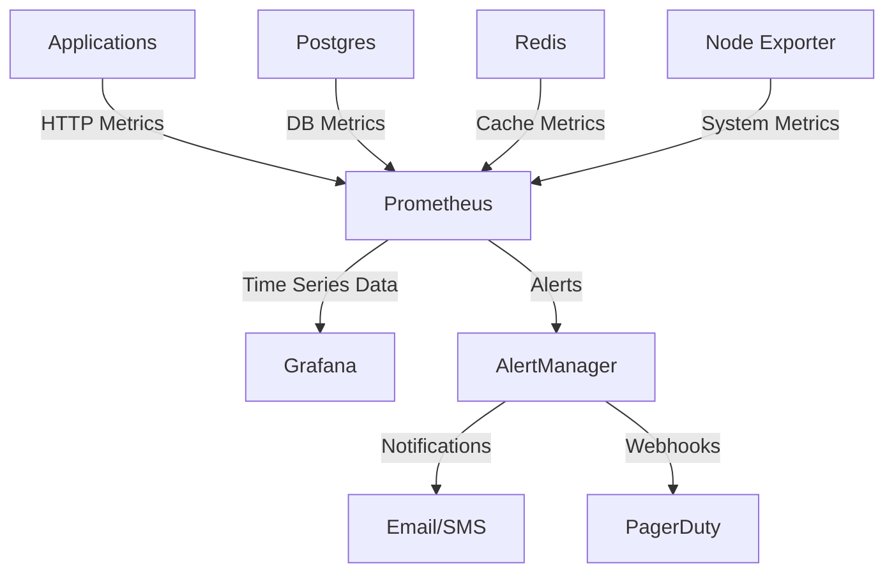
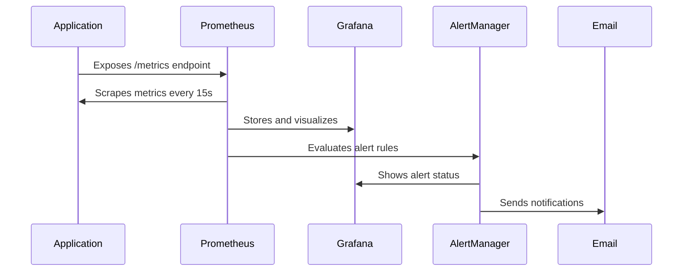

# Monitoring & Observability Documentation

This document provides comprehensive guidance for monitoring the Support Center platform using Prometheus, Grafana, and AlertManager.

## Table of Contents
- [Architecture Overview](#architecture-overview)
- [Metrics Collection](#metrics-collection)
- [Prometheus Configuration](#prometheus-configuration)
- [Grafana Dashboards](#grafana-dashboards)
- [Alert Manager Configuration](#alert-manager-configuration)
- [Metric Definitions](#metric-definitions)
- [Troubleshooting](#troubleshooting)
- [Best Practices](#best-practices)

## Architecture Overview

```
┌─────────────────┐     ┌─────────────────┐     ┌─────────────────┐
│   Applications   │────▶│   Prometheus    │────▶│    Grafana      │
│  (Backend,      │     │   (Scrape      │     │   (Visualization)│
│  Frontend,      │     │   Config)      │     │                │
│  Tauri)         │     └─────────────────┘     └─────────────────┘
└─────────────────┘           │                       │
                              ▼                       ▼
┌─────────────────┐     ┌─────────────────┐     ┌─────────────────┐
│   Database      │     │  AlertManager   │     │    Logging      │
│  (PostgreSQL)   │     │   (Alerts)     │     │   (Loki/ES)    │
└─────────────────┘     └─────────────────┘     └─────────────────┘
```

## Metrics Collection

### 1. Backend Metrics (FastAPI)
The backend exposes metrics via `/metrics` endpoint using prometheus-fastapi-instrumentator.

**Key Metrics:**
- `http_requests_total` - Total HTTP requests by status code and endpoint
- `http_request_duration_seconds` - Request duration
- `http_request_size_bytes` - Request size
- `http_response_size_bytes` - Response size
- `fastapi_dependencies_total` - Dependency call counts
- `fastapi_exceptions_total` - Exception counts
- `database_connection_pool_size` - Active DB connections
- `celery_task_duration_seconds` - Celery task execution time
- `redis_operations_total` - Redis operation counts

### 2. Database Metrics
PostgreSQL metrics collected via `postgres_exporter`:
- `pg_stat_database_numbackends` - Active connections
- `pg_stat_database_tup_returned` - Rows returned
- `pg_stat_database_tup_fetched` - Rows fetched
- `pg_stat_database_tup_inserted` - Rows inserted
- `pg_stat_database_tup_updated` - Rows updated
- `pg_stat_database_tup_deleted` - Rows deleted
- `pg_stat_database_blks_read` - Blocks read
- `pg_stat_database_blks_hit` - Cache hits

### 3. Application Metrics
Application-specific metrics exposed via custom collectors:
- Support request queue length
- Chat session counts
- Active desktop sessions
- File upload/download metrics
- Authentication success/failure rates

## Prometheus Configuration

### prometheus.yml
```yaml
global:
  scrape_interval: 15s
  evaluation_interval: 15s

rule_files:
  - "alert_rules.yml"

scrape_configs:
  # Backend Services
  - job_name: 'backend-api'
    static_configs:
      - targets: ['backend:8000']
    metrics_path: '/metrics'
    scrape_interval: 15s
    scrape_timeout: 10s

  # PostgreSQL
  - job_name: 'postgres'
    static_configs:
      - targets: ['postgres-exporter:9187']
    scrape_interval: 30s

  # Redis
  - job_name: 'redis'
    static_configs:
      - targets: ['redis-exporter:9121']
    scrape_interval: 30s

  # Node Exporter (for infrastructure)
  - job_name: 'node'
    static_configs:
      - targets: ['node-exporter:9100']
    scrape_interval: 30s

  # Docker Containers
  - job_name: 'cadvisor'
    static_configs:
      - targets: ['cadvisor:8080']
    scrape_interval: 30s
```

### Alert Rules (alert_rules.yml)
```yaml
groups:
  - name: backend-alerts
    rules:
      - alert: HighErrorRate
        expr: rate(http_requests_total{status_code=~"5.."}[5m]) > 0.1
        for: 5m
        labels:
          severity: critical
        annotations:
          summary: "High error rate detected"
          description: "Error rate is {{ $value }} errors per second"

      - alert: HighLatency
        expr: histogram_quantile(0.95, rate(http_request_duration_seconds_bucket[5m])) > 2
        for: 5m
        labels:
          severity: warning
        annotations:
          summary: "High latency detected"
          description: "95th percentile latency is {{ $value }} seconds"

  - name: database-alerts
    rules:
      - alert: DatabaseConnectionsHigh
        expr: pg_stat_database_numbackends{datname="support_center"} > 80
        for: 5m
        labels:
          severity: warning
        annotations:
          summary: "High database connections"
          description: "{{ $value }} active connections"

      - alert: DatabaseDeadlocks
        expr: increase(pg_stat_database_deadlocks[5m]) > 0
        for: 1m
        labels:
          severity: critical
        annotations:
          summary: "Database deadlocks detected"
          description: "{{ $value }} deadlocks in last 5 minutes"
```

## Grafana Dashboards

### Dashboard URLs and Descriptions

1. **System Overview (ID: 1)**
   - URL: `http://grafana/d/system-overview`
   - Description: High-level view of system health including CPU, memory, and application metrics
   - Key Panels:
     - System resource utilization
     - Request rates and errors
     - Database performance
     - Queue lengths

2. **Backend API (ID: 2)**
   - URL: `http://grafana/d/backend-api`
   - Description: Detailed API performance metrics
   - Key Panels:
     - Request rate by endpoint
     - Response times by status code
     - Error rates
     - Dependency call metrics

3. **Database Performance (ID: 3)**
   - URL: `http://grafana/d/database-performance`
   - Description: PostgreSQL metrics and query performance
   - Key Panels:
     - Connection counts
     - Query execution times
     - Cache hit ratios
     - Table I/O statistics

4. **Business Metrics (ID: 4)**
   - URL: `http://grafana/d/business-metrics`
   - Description: Support center specific metrics
   - Key Panels:
     - Support request counts by status
     - Chat session metrics
     - Active desktop sessions
     - SLA compliance

5. **Alert Management (ID: 5)**
   - URL: `http://grafana/d/alert-management`
   - Description: Alert tracking and management
   - Key Panels:
     - Alert counts by severity
     - Alert duration
     - Alert silence periods
     - Alert firing status

### Custom Panel JSON Examples

#### Support Request Queue Length Panel
```json
{
  "aliasColors": {},
  "bars": false,
  "dashLength": 10,
  "dashes": false,
  "fill": 1,
  "gridPos": {
    "h": 8,
    "w": 12,
    "x": 0,
    "y": 0
  },
  "hiddenSeries": false,
  "id": 1,
  "legend": {
    "avg": false,
    "current": false,
    "max": false,
    "min": false,
    "show": true,
    "total": false,
    "values": false
  },
  "lines": true,
  "linewidth": 1,
  "nullPointMode": "null",
  "options": {
    "dataLinks": []
  },
  "percentage": false,
  "pointradius": 2,
  "points": false,
  "renderer": "flot",
  "series": [
    {
      "aliasColors": {},
      "bars": false,
      "dashLength": 10,
      "dashes": false,
      "fill": 1,
      "id": null,
      "legend": {
        "avg": false,
        "current": false,
        "max": false,
        "min": false,
        "show": true,
        "total": false,
        "values": false
      },
      "lines": true,
      "linewidth": 1,
      "nullPointMode": "null",
      "percentage": false,
      "pointradius": 2,
      "points": false,
      "renderer": "flot",
      "seriesName": "Pending Requests",
      "stack": false,
      "steppedLine": false,
      "targets": [
        {
          "expr": "support_requests_pending",
          "format": "time_series",
          "instant": false,
          "intervalFactor": 1,
          "legendFormat": "Pending",
          "refId": "A"
        }
      ],
      "thresholds": [],
      "timeFrom": null,
      "timeShift": null,
      "title": "Support Request Queue",
      "tooltip": {
        "shared": true,
        "sort": 0,
        "value_type": "individual"
      },
      "type": "graph",
      "xaxis": {
        "buckets": null,
        "mode": "time",
        "name": null,
        "show": true,
        "values": []
      },
      "yaxes": [
        {
          "format": "short",
          "label": null,
          "logBase": 1,
          "max": null,
          "min": null,
          "show": true
        },
        {
          "format": "short",
          "label": null,
          "logBase": 1,
          "max": null,
            "min": null,
          "show": false
        }
      ],
      "yaxis": {
        "align": false,
        "alignLevel": null
      }
    }
  ],
  "spaceLength": 10,
  "stack": false,
  "steppedLine": false,
  "timeFrom": null,
  "timeShift": null,
  "title": "Support Request Queue Length",
  "tooltip": {
    "shared": true,
    "sort": 0,
    "value_type": "individual"
  },
  "type": "graph",
  "xaxis": {
    "buckets": null,
    "mode": "time",
    "name": null,
    "show": true,
    "values": []
  },
  "yaxes": [
    {
      "format": "short",
      "label": "Requests",
      "logBase": 1,
      "max": null,
      "min": null,
      "show": true
    },
    {
      "format": "short",
      "label": null,
      "logBase": 1,
      "max": null,
      "min": null,
      "show": false
    }
  ],
  "yaxis": {
    "align": false,
    "alignLevel": null
  }
}
```

## Alert Manager Configuration

### alertmanager.yml
```yaml
global:
  smtp_smarthost: 'localhost:587'
  smtp_from: 'alerts@support-center.com'
  smtp_auth_username: 'alerts@support-center.com'
  smtp_auth_password: 'your-password'

route:
  group_by: ['alertname']
  group_wait: 10s
  group_interval: 10s
  repeat_interval: 1h
  receiver: 'web.hook'

receivers:
- name: 'web.hook'
  webhook_configs:
  - url: 'http://alertmanager-webhook:5001/'

- name: 'email'
  email_configs:
  - to: 'admin@support-center.com'
    subject: 'Alert: {{ .GroupLabels.alertname }}'
    body: |
      {{ range .Alerts }}
      Alert: {{ .Annotations.summary }}
      Description: {{ .Annotations.description }}
      Status: {{ .Status }}
      Labels: {{ .Labels }}
      {{ end }}

inhibit_rules:
  - source_match:
      severity: 'critical'
    target_match:
      severity: 'warning'
    equal: ['alertname', 'dev', 'instance']
```

## Metric Definitions and Meanings

### HTTP Metrics
- `http_requests_total`: Total HTTP requests served
  - Labels: `method`, `status_code`, `endpoint`
  - Meaning: Track total traffic and error rates

- `http_request_duration_seconds`: Request duration histogram
  - Labels: `method`, `status_code`, `endpoint`
  - Buckets: 0.1, 0.5, 1, 2, 5, 10 seconds
  - Meaning: Monitor API performance and identify slow endpoints

### Database Metrics
- `pg_stat_database_numbackends`: Current number of connections
  - Meaning: Monitor connection pool usage

- `pg_stat_database_blks_hit`: Cache hit count
  - Meaning: Monitor query performance and cache efficiency

### Business Metrics
- `support_requests_pending`: Number of pending support requests
  - Labels: `priority`, `category`
  - Meaning: Track workload and identify bottlenecks

- `chat_sessions_active`: Active chat sessions
  - Meaning: Monitor real-time user engagement

### System Metrics
- `node_cpu_seconds_total`: CPU time usage
  - Labels: `mode` (user, system, idle)
  - Meaning: Monitor system resource utilization

- `node_memory_MemAvailable`: Available memory
  - Meaning: Monitor memory pressure

## Troubleshooting Procedures

### 1. Metrics Not Appearing in Grafana

**Check Prometheus:**
```bash
# Check if Prometheus is scraping targets
curl http://prometheus:9090/api/v1/targets

# Check specific target status
curl http://prometheus:9090/api/v1/targets?target=backend:8000

# Check recent scrape errors
curl http://prometheus:9090/api/v1/alerts
```

**Check Application:**
```bash
# Verify metrics endpoint is accessible
curl http://backend:8000/metrics

# Check application logs for metric collection errors
docker logs backend
```

### 2. High CPU Usage

**Identify Culprits:**
```bash
# Top CPU consuming containers
docker stats --no-stream

# Prometheus query for high CPU containers
rate(node_cpu_seconds_total{mode!="idle"}[5m])

# Check specific process
top -c -p $(pgrep -f backend)
```

**Resolution Steps:**
1. Check application logs for errors
2. Profile application performance
3. Scale horizontally if needed
4. Optimize slow queries

### 3. Database Performance Issues

**Monitor Queries:**
```bash
# Check slow queries
SELECT query, mean_time FROM pg_stat_statements
ORDER BY mean_time DESC LIMIT 10;

# Monitor connection pool
SELECT count(*) FROM pg_stat_activity
WHERE state = 'active';
```

**Prometheus Queries:**
```prometheus
# Slow queries
pg_stat_database_tup_fetched / pg_stat_database_tup_returned

# Cache hit ratio
rate(pg_stat_database_blks_hit[5m]) /
rate(pg_stat_database_blks_hit[5m] + pg_stat_database_blks_read[5m])
```

### 4. Alert Flood

**Common Causes:**
- Flaky metrics
- Misconfigured thresholds
- Rapid state changes

**Mitigation:**
```yaml
# Example: Configure longer evaluation periods
- alert: HighErrorRate
  expr: rate(http_requests_total{status_code=~"5.."}[5m]) > 0.1
  for: 10m  # Increased from 5m
```

## Best Practices

### 1. Metric Collection
- Use meaningful labels (not too many, not too few)
- Prefer counters over gauges where possible
- Use histograms for timing metrics
- Avoid high-cardinality labels

### 2. Alerting
- Set appropriate time windows for alerts
- Group related alerts
- Include descriptive annotations
- Test alert rules before production

### 3. Dashboard Design
- Use consistent naming conventions
- Include time range selectors
- Show both current and historical data
- Add annotations for deployments

### 4. Resource Management
- Monitor Prometheus storage usage
- Configure retention policies
- Use recording rules for expensive queries
- Clean up unused dashboards and alerts

### 5. Documentation
- Document all custom metrics
- Keep alert rules up to date
- Share dashboard links with the team
- Regularly review and optimize monitoring setup

## Architecture Diagrams

### High-Level Architecture


### Metrics Flow
